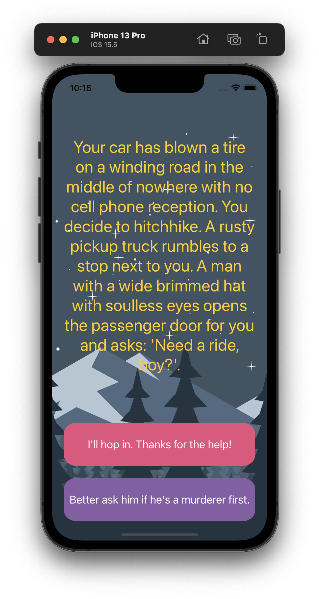

#  Destini

## Our Goal

The goal of this challenge is to learn how to implement the MVC design pattern and think about the state of the application. Additionally, we looked at the concept of Swift structs and used it to separate the model from the controller.

## What did I create

In this app, I created a “choose your own adventure” game similar to the App Store hit “Life Line” app. The app will tell a story depending on what the user chooses and can be fleshed out and modified to provide an engaging story-telling experience. This app supports Russian and English.

